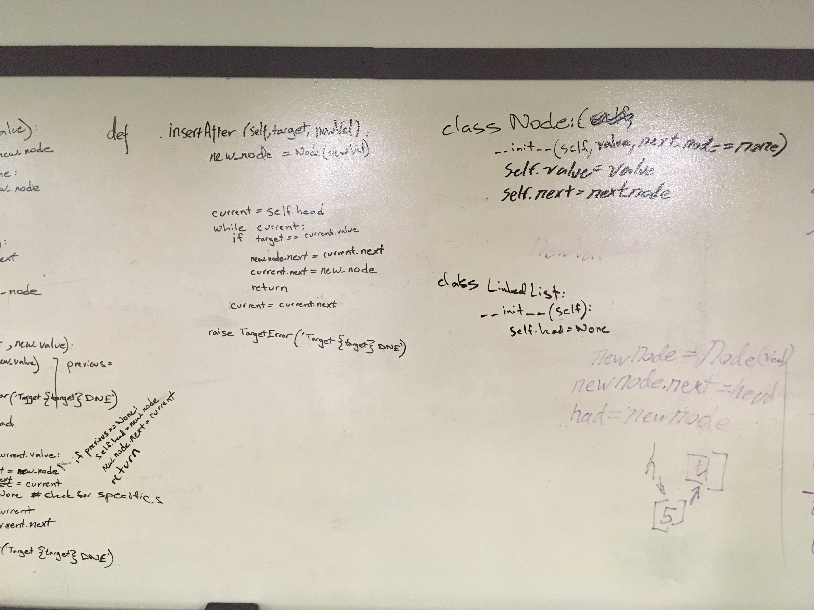
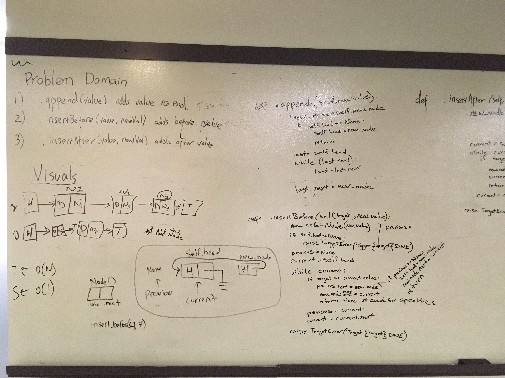

# Singly Linked List
A linked list provides an alternative to an array-based structure. A linked list, in its simplest form, in a collection of nodes that collectively form linear sequence. In a singly linked list, each node stores a reference to an object that is an element of the sequence, as well as a reference to the next node of the list. It does not store any pointer or reference to the previous node. To store a single linked list, only the reference or pointer to the first node in that list must be stored. The last node in a single linked list points to nothing.

## Challenge
Create a Node class that has properties for the value stored in the Node, and a pointer to the next Node.
Within your LinkedList class, include a head property. Upon instantiation, an empty Linked List should be created. Create methods in the LinkedList class that can insert, check for inclusion, and list nodes.

## Approach & Efficiency
Reading approach as laid out in Data Structures and Algorithms in Python. Will update readme
with better explanation as I go.
```
space <- O(n)
time  <- O(n)
```
## API
- insert, which takes any value as an argument and adds a new node with that value to the head of the list with an O(1) Time performance.
- includes, which takes any value as an argument and returns a boolean result depending on whether that value exists as a Node’s value somewhere within the list.
- __str__, which takes in no arguments and returns a string representing all the values in the Linked List.

## Tests
- Can successfully instantiate an empty linked list
- Can properly insert into the linked list
- The head property will properly point to the first node in the linked list
- Can properly insert multiple nodes into the linked list
- Will return true when finding a value within the linked list that exists
- Will return false when searching for a value in the linked list that does not exist
- Can properly return a collection of all the values that exist in the linked list
- Can properly insert value before given value.
- Can properly insert value after a given value.
- Can properly append value to linked list.l

## Solution

