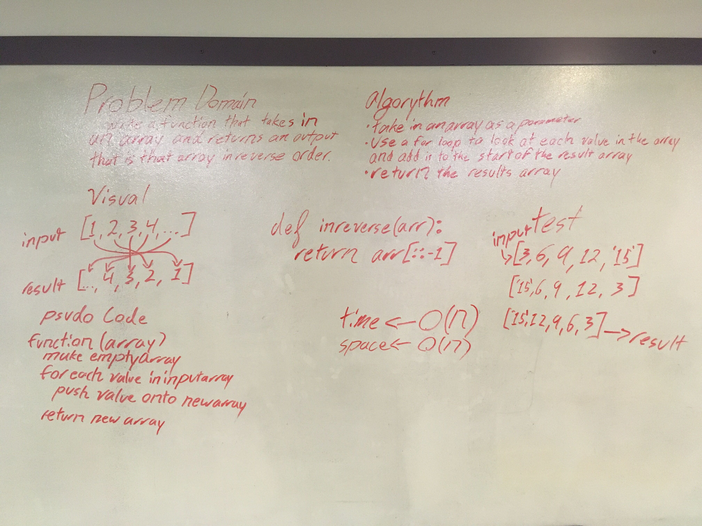

# Reverse an Array
Reversing a list is a common operation in Python programming.

## Tests

None (first code challenge, none required)

## Challenge
Write a function called reverseArray which takes an array as an argument. Without utilizing any of the built-in methods available in Python, return an array with elements in reversed order.

## Approach & Efficiency
Python has a built-in reverse() method, which modifies the original list in place. It's fast and doesn't require much memory, as it's not creating a full copy of the list. However as it was a built-in I instead chose to use list slicing (arr[::-1]

This solution takes up more memory compared to in-place reversal as it creates a (shallow) copy of the list.

More information [here](https://dbader.org/blog/python-reverse-list).

Big O notation
time <- O(2n)
space <- O(2n)

## Solution
