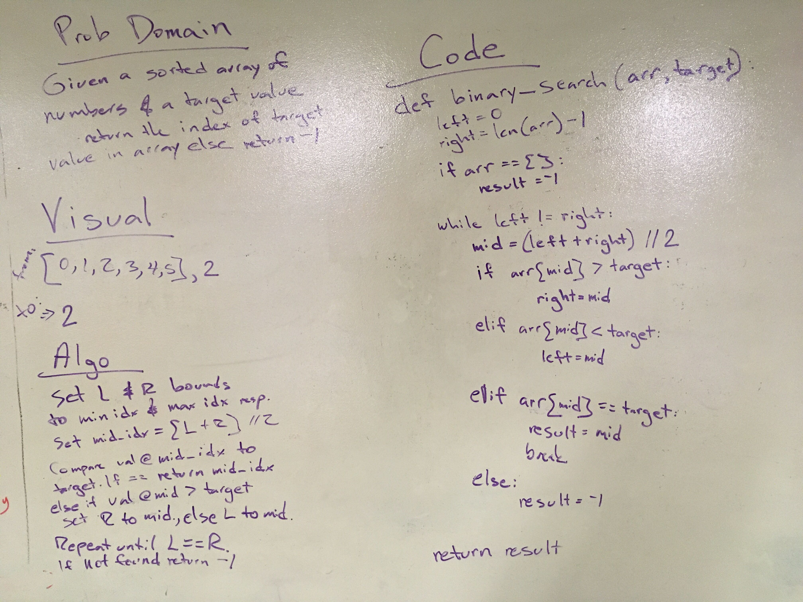

# Array Binary Search of 1D Array
Given a sorted array of numbers and a target value, return the index of the target value in the array. 
If it's not found return -1.

## Tests
```
test_binary_search_null - Test for empty array. 
test_binary_search_even - Test for even array.
test_binary_search_odd - Test for odd array.
test_binary_search_not_found - Test for target value not found in array.
```
## Challenge
Write a function called binary_search which takes in 2 parameters: a sorted array and the search key. 
Return the index of the array’s element that is equal to the search key, or -1 if the element does not exist.

## Approach & Efficiency
```
Set left and right bounds of array to left and right vars respectively.
Set mid_idx = (left + right) // 2. 
Compare val at mid_idx to target val.
If they're equal return mid_idx,
else if val @ mid > target, set right to mid, else set left to mid val.
Repeat until left == right. If target value not found, return -1.
```

Big O notation
```
time <- O(log n)
space <- O(log n)
```
## Solution
