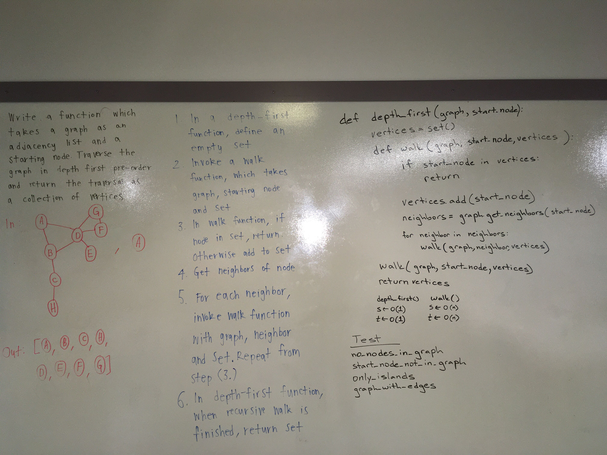

# Code Challenge 38 - Graph Depth First Traversal

| | |
|:-|:-|
| *Author:*      | Aaron Imbrock |
| *Create Date:* | 01/29/2020    |
| *Language:*    | Python 3.8    |

Create a function that accepts an adjacency list as a graph, and conducts a depth first traversal. Without utilizing any of the built-in methods available to your language, return a collection of nodes in their pre-order depth-first traversal order.

## Challenge

In a public repository called data-structures-and-algorithms, with a well-formatted, detailed top-level README.md
create a branch in your repository called `depth-first`.
On your branch, create…

- A folder named depth_first which contains files called depth_first.py, test_depth_first.py, and a README.md file.
- Include any language-specific configuration files required for this challenge to become an individual component, module, library, etc.

## Tests

| Test Name     | Description       |
| :-------------|:-------------     |
| test_no_nodes_in_graph | Graph has no vertices. Return an empty set. |
| test_start_node_not_in_graph | Node not present on graph. Return an empty set. |
| test_only_islands | Nodes have no vertices. Only returns start_node. |
| test_graph_with_edges | All nodes have at least one neighbor. Correctly returns start_node's neighbors. |

## Big O notation

walk()

- time <- O(n)
- space <- O(n)

depth_first()

- time <- O(1)
- space <- O(1)

## Solution

