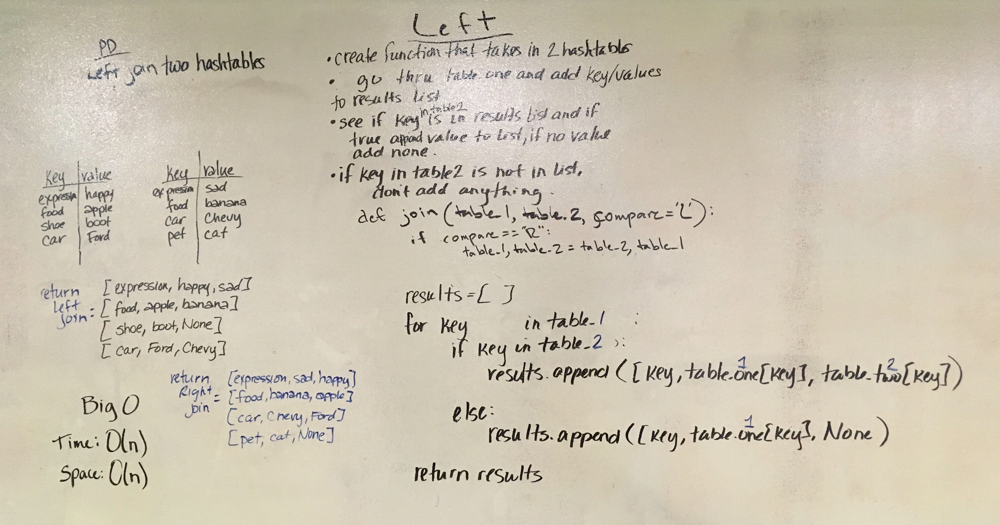

# Code Challenge 33 - left-join

| | |
|:-|:-|
| *Author:*      | Aaron Imbrock |
| *Create Date:* | 01/22/2020    |
| *Language:*    | Python 3.8    |

Implement a simplified LEFT JOIN for 2 Hashmaps.

## Challenge

- Write a function that LEFT JOINs two hashmaps into a single data structure.
- The first parameter is a hashmap that has word strings as keys, and a synonym of the key as values.
- The second parameter is a hashmap that has word strings as keys, and antonyms of the key as values.
- Combine the key and corresponding values (if they exist) into a new data structure according to LEFT JOIN logic.
- LEFT JOIN means all the values in the first hashmap are returned, and if values exist in the “right” hashmap, they are appended to the result row. If no values exist in the right hashmap, then some flavor of `NULL` should be appended to the result row.
- The returned data structure that holds the results is up to you. It doesn’t need to exactly match the output below, so long as it achieves the LEFT JOIN logic.
- Stretch Goal:
  - Consider a RIGHT JOIN. Can you implement this as a new function? How about by passing an optional parameter to your initial function, to speficy if LEFT JOIN or RIGHT JOIN logic should be used?

### Inputs

| Synonym Hashtable ||
| :------------- |:-------------|
| fond      | enamored |
| wrath      | anger      |
| outfit | garb      |
| ... | ... |

| Antonym Hashtable ||
| :------------- |:-------------|
| fond      | averse |
| wrath      | delight      |
| diligent | idle      |
| ... | ... |

### Outputs

```python
[
    ['fond', 'enamored', 'averse'],
    ['wrath', 'anger', 'delight'],
    ['outfit', 'garb', None],
]
```

## Tests

| Test Name     | Description       |
| :-------------|:-------------     |
| test_         | what it does      |
| test_         | what it does      |
| test_         | also what it does |

## Big O notation

- time <- O(n)
- space <- O(n)

## Solution


