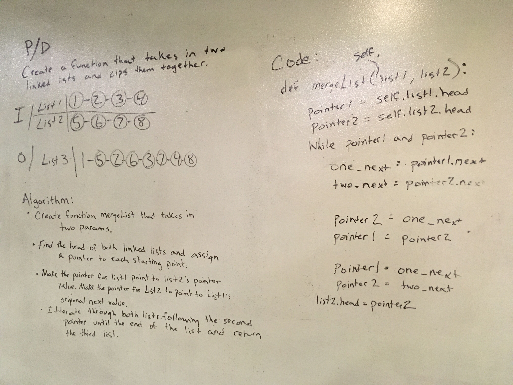

# Code Challenge 08 
Write a function called merge_lists which takes two linked lists as arguments. Zip the two linked lists together into one so that the nodes alternate between the two lists and return a reference to the head of the zipped list. Try and keep additional space down to O(1). You have access to the Node class and all the properties on the Linked List class as well as the methods created in previous challenges.

## Tests
- test_lists_of_equal_size - Test for lists of equal size zipper correctly. 
- test_list1_is_longer - Test that lists of unequal length zipper correctly.
- test_list2_is_longer - Test that lists of unequal length zipper correctly.

## Challenge
Write a function called merge_lists which takes two linked lists as arguments. Zip the two linked lists together into one so that the nodes alternate between the two lists and return a reference to the head of the zipped list.

## Big O notation
- time <- O(log n)
- space <- O(log n)

## Solution
