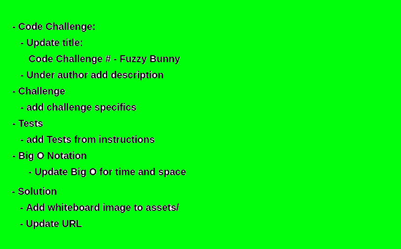

# Code Challenge

| | |
|:-|:-|
| *Author:*      | Aaron Imbrock |
| *Create Date:* | 01/01/2020    |
| *Language:*    | Python 3.8    |

This is the description.
it goes here.

## Challenge

Challenge Details...

```python
s = "Python syntax highlighting"
print s
```

| Example       | Table         | 1     |
| ------------- |:-------------:| -----:|
| col 3 is      | right-aligned | $1600 |
| col 2 is      | centered      |   $12 |
| zebra stripes | are neat      |    $1 |

## Tests

| Test Name     | Description       |
| :-------------|:-------------     |
| test_         | what it does      |
| test_         | what it does      |
| test_         | also what it does |

## Big O notation

- time <- O(n)
- space <- O(n)

## Solution

